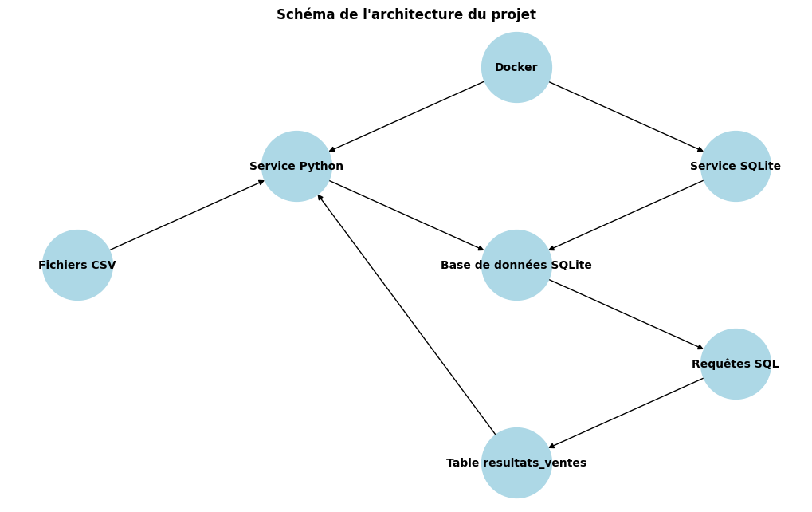
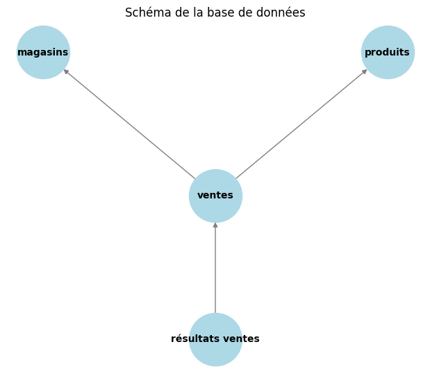

# Projet data engineering - Python + SQLite + Docker

## 📌 Description du projet
Ce projet consiste à analyser les ventes d'une PME en utilisant Python, SQLite et Docker. L'objectif est d'automatiser le processus d'importation, de transformation et d'analyse des données de ventes à partir de fichiers CSV.

## 🚀 Technologies utilisées
- **Python** : Pour le traitement des données
- **SQLite** : Base de données relationnelle
- **Docker** : Conteneurisation de l'application
- **Pandas** : Manipulation des données
- **DB Browser for SQLite** : Visualisation de la base de données

---

## 📂 Structure du projet
```
projet_data_engineer/
│── data/			# Fichiers CSV des ventes, magasins et produits
│── database.db			# Base de données SQLite
│── main.py			# Script principal d'exécution
│── Dockerfile			# Configuration du conteneur Python
│── docker-compose.yml		# Orchestration des services
│── README.md			# Documentation du projet
│── images/			# Schémas de l'architecture et de la BDD
└── requirements.txt		# Bibliothèques Python nécessaires
```

---

## 🔧 Installation et exécution
### 1️⃣ **Prérequis**
- Avoir **Docker** installé ([télécharger ici](https://www.docker.com/))
- Avoir **Git** installé
- Cloner le projet :
  ```bash
  git clone https://github.com/RominaSR/projet_data_engineer.git
  cd projet_data_engineer
  ```

### 2️⃣ **Lancer le projet avec Docker**
```bash
docker-compose up --build
```
✅ Cette commande va :
- Construire l'image Docker
- Exécuter le conteneur Python
- Lancer l'importation et l'analyse des données

### 3️⃣ **Vérifier les résultats dans SQLite**
Ouvrir **DB Browser for SQLite** et charger `database.db`.
Exécuter la requête suivante pour voir les analyses :
```sql
SELECT * FROM resultats_ventes;
```

---

## 📊 Schémas
### **1️⃣ Architecture du projet**
Le schéma ci-dessous représente l'architecture du projet. Il montre comment les différents composants interagissent :
- Docker orchestre les services Python et SQLite.
- Le service Python récupère les données des fichiers CSV et les insère dans la base de données SQLite.
- Le service SQLite exécute les requêtes SQL et stocke les résultats des analyses dans la table resultats_ventes.


### **2️⃣ Modèle relationnel de la base de données**
Ce schéma représente la structure de la base de données et les relations entre les tables :
- La table ventes est au centre, reliant les informations des produits et des magasins.
- Les résultats des analyses SQL sont stockés dans la table resultats_ventes.



---

## 📈 Résultats obtenus
Les analyses SQL permettent d'obtenir :
✅ **Chiffre d'affaires total**
✅ **Ventes par produit**
✅ **Ventes par région**

---

## 🎥 Démonstration vidéo

[](https://youtu.be/BvN35WiO8q0)

📌 **Cliquez sur l'image pour voir la démonstration sur YouTube.**


---

## 📌 Auteurs
👩‍💻 **Romina Soledad Romay** 🎉

